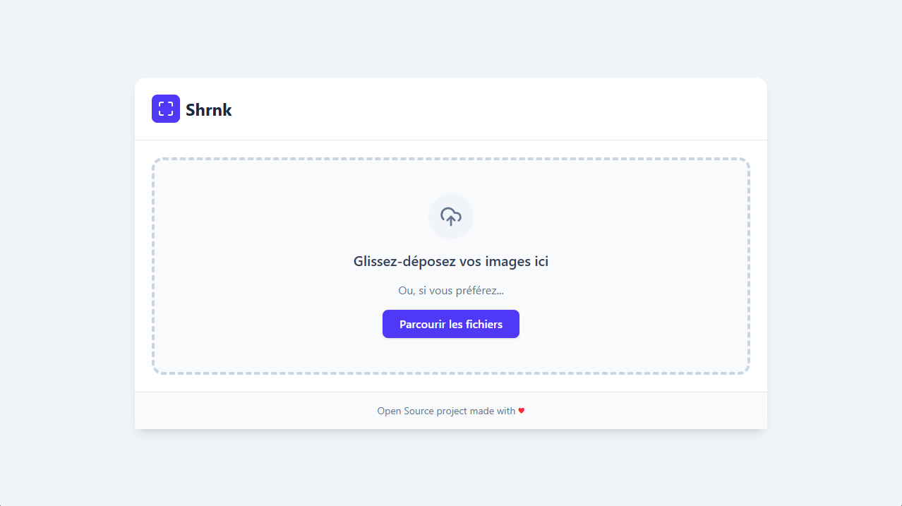
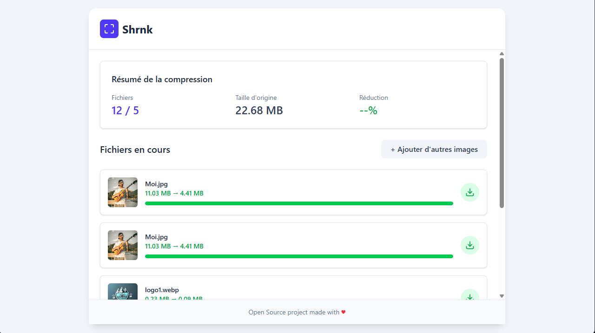

# Shrnk ⚡

Shrnk est une application web ultra-rapide pour la compression d'images, conçue pour être à la fois performante et simple d'utilisation. L'interface est construite avec React et TypeScript, tandis que le moteur de compression est pensé pour être propulsé par Rust (compilé en WebAssembly) pour des performances natives directement dans le navigateur.

Ce projet met l'accent sur une expérience utilisateur (UX) moderne, avec un design épuré, un glisser-déposer intuitif et un retour visuel en temps réel.




## 🚀 Fonctionnalités

- **Interface Moderne :** Un design épuré, centré et responsive construit avec Tailwind CSS.
- **Glisser-déposer Global :** Déposez vos fichiers n'importe où sur la fenêtre pour les ajouter à la file d'attente.
- **Aperçus Instantanés :** Prévisualisation des images avant même la compression.
- **Suivi en Temps Réel :** Voyez la progression de la compression pour chaque fichier.
- **Résumé Détaillé :** Un récapitulatif affiche le nombre de fichiers traités, la taille d'origine et la réduction totale obtenue.
- **Typage Sécurisé :** Entièrement écrit en TypeScript pour une meilleure maintenabilité.

## 🛠️ Stack Technique

- **Frontend :** [React](https://react.dev/) & [TypeScript](https://www.typescriptlang.org/)
- **Styling :** [Tailwind CSS](https://tailwindcss.com/)
- **Moteur de Compression (Cible) :** [Rust](https://www.rust-lang.org/) compilé en [WebAssembly (WASM)](https://webassembly.org/)

## 💡 Philosophie du Projet

Ce projet vise à combiner le meilleur des deux mondes :

1.  **React & TypeScript** pour une interface utilisateur réactive, déclarative et robuste.
2.  **Rust & WebAssembly** pour déporter la logique métier lourde (la compression d'image) du thread JavaScript principal. Cela permet d'obtenir des performances quasi-natives sans jamais bloquer l'interface utilisateur, même lors du traitement de dizaines d'images.

## 📦 Installation & Lancement

Ce guide concerne le lancement de l'interface React. L'intégration du module Rust/WASM est une étape séparée.

1.  **Cloner le dépôt :**

    ```bash
    git clone https://github.com/votre-nom/shrnk.git
    cd shrnk
    ```

2.  **Installer les dépendances :**

    ```bash
    npm install
    ```

3.  **Lancer le serveur de développement :**
    ```bash
    npm run dev
    ```

L'application devrait maintenant être accessible sur `http://localhost:5173` (ou un port similaire).

## 🧩 Intégrer votre moteur Rust (WASM)

Actuellement, l'application **simule** la compression pour démontrer le fonctionnement de l'interface. La simulation se trouve dans `src/App.tsx`, au sein du composant `FileProcessingItem`.

Pour finaliser l'application, vous devrez remplacer cet effet :

```typescript
// src/App.tsx -> FileProcessingItem

// Effet pour simuler la compression (à remplacer par votre appel Rust/WASM)
useEffect(() => {
  setStatus("compressing");
  const interval = setInterval(() => {
    // ... logique de simulation
  }, 200);

  const compressionTimer = setTimeout(() => {
    // ... logique de simulation

    // C'EST ICI QU'IL FAUT RENVOYER LE RÉSULTAT
    onCompressionDone(fileId, finalSize);
  }, 2500);

  return () => {
    clearInterval(interval);
    clearTimeout(compressionTimer);
  };
}, [file, fileId, onCompressionDone]);
```

Vous devez

1.  **Compiler votre code Rust en WASM (avec wasm-pack ou similaire).**

2.  **Importer votre module WASM dans ce composant.**

3.  **Appeler votre fonction de compression Rust au lieu du `setTimeout`.**

4.  **Utiliser le `onCompressionDone(fileId, finalSize)` pour notifier l'interface que le travail est terminé.**

## 🤝 Contribuer

Les contributions sont les bienvenues ! N'hésitez pas à ouvrir une issue pour signaler un bug ou proposer une nouvelle fonctionnalité.

1.  **Forkez le projet.**

2.  **Créez votre branche.**

3.  **Commitez vos changements.**

4.  **Pushez sur la branche.**

5.  **Ouvrez une Pull Request**

## 📄 Licence

Ce projet est sous licence MIT. Voir le fichier `LICENCE` pour plus de détails.
